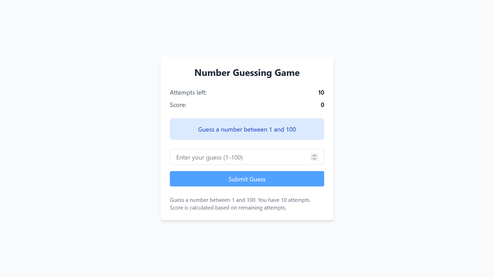
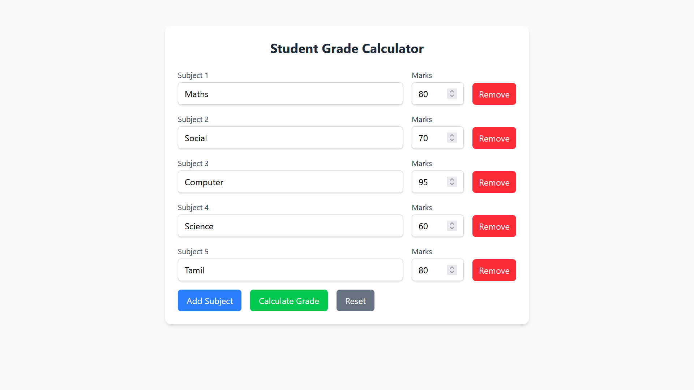
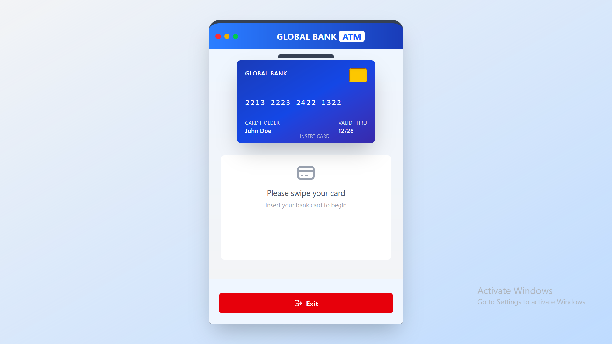
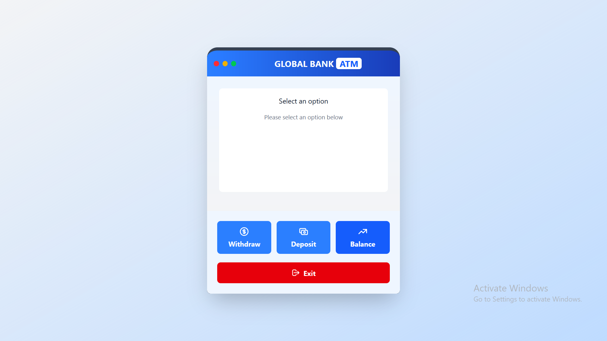
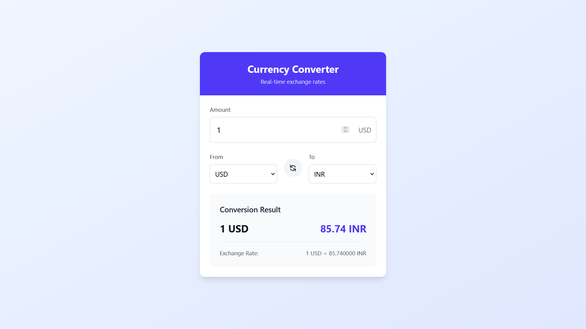
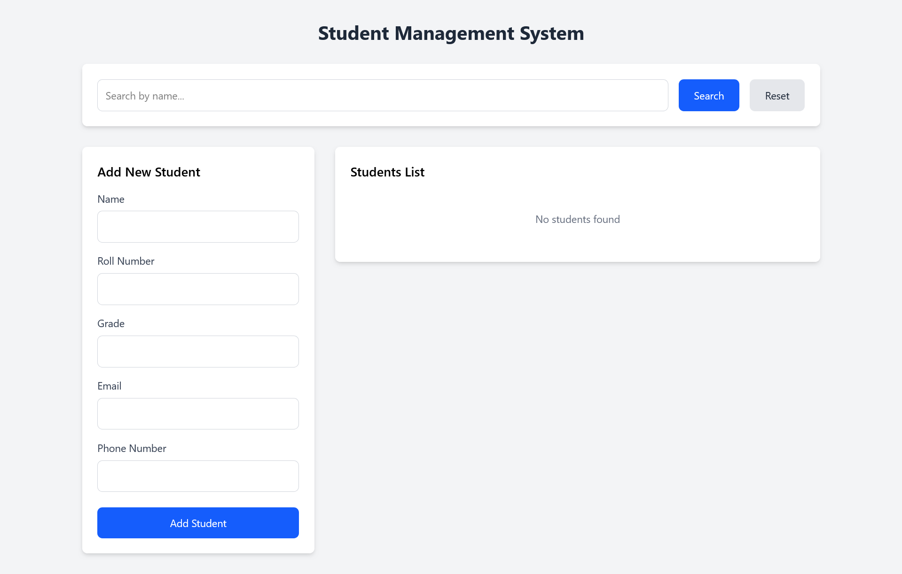
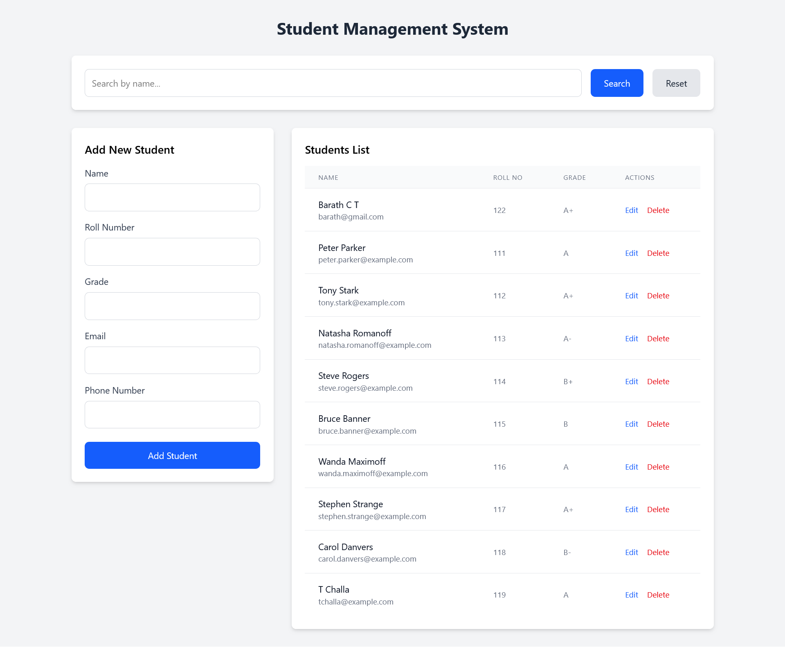

# 📚 Full Stack Project Collection

A collection of 5 full-stack applications built using **React (Vite)**, **Tailwind CSS**, **Axios**, and **Spring Boot** (Java) for the backend. The **Student Management System** also includes a **MySQL** database for persistent storage.

---

## 🚀 Projects Overview

### 1. 🎯 Number Guessing Game

* A simple game where users guess a random number.
* React handles the UI and form input.
* Backend in Spring Boot generates and validates the random number.




---


### 2. 📊 Student Grade Calculator

* Users input marks for various subjects.
* Calculates average, percentage, and grade.
* Backend logic handles grade assignment and evaluation.




---


### 3. 🏧 ATM Interface

* Simulates an ATM system.
* Features include: balance check, withdrawal, deposit.
* Backend maintains virtual account state.




---


### 4. 💱 Currency Converter

* Convert currency in real-time.
* Fetches live exchange rates via backend API.
* Clean, responsive UI with conversion history.




---


### 5. 🧑‍🎓 Student Management System

* Complete CRUD operations (Create, Read, Update, Delete).
* Fully integrated with a **MySQL** database.
* Features include search, sorting, and real-time updates.






---

## 🧰 Tech Stack

### 🖥️ Frontend (All Projects)

* 
* 
* 
* 

### ⚙️ Backend (All Projects)

* 
* 
* 

### 🛢️ Database (Only for Student Management System)

* 

---

## 📁 Folder Structure

```
CODSOFT/
├── Task1 (Number Guess)/
│   ├── frontend/     # React + Vite + Tailwind CSS
│   └── backend/      # Spring Boot
│
├── Task2 (Student Grade Calculator)/
│   ├── frontend/
│   └── backend/
│
├── Task3 (ATM Interface)/
│   ├── frontend/
│   └── backend/
│
├── Task4 (Currency Converter)/
│   ├── frontend/
│   └── backend/
│
├── Task5 (Student Management System)/
│   ├── frontend/
│   └── backend/      # Spring Boot + MySQL
│
└── README.md
```

---

## 🛠️ Installation Guide

### 📦 Prerequisites

* Node.js (v16+)
* Java JDK (17+)
* Maven
* MySQL (only for student-management)

### 🔧 Setup Instructions (for each project)

#### Frontend

```bash
cd frontend
npm install
npm run dev
```

#### Backend

```bash
cd backend
mvn clean install
mvn spring-boot:run
```

> 💡 For **Student Management System**, make sure MySQL is running and credentials are set in `application.properties`.

---

## 👨‍💻 Author

**Barath CT**
📧 [barathctb@gmail.com](mailto:barathctb@gmail.com)

---

## ⭐ Support

If you find these projects useful, give the repo a ⭐ on GitHub to show your support!

---
