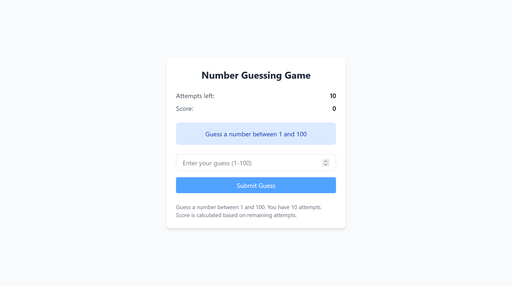
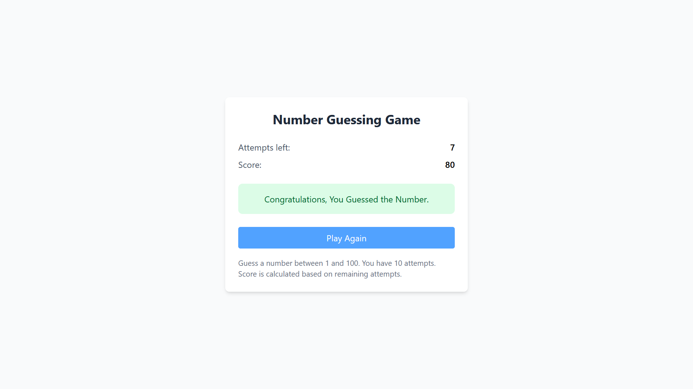

# 🎯 Number Guessing Game

A full-stack number guessing game where players try to guess a randomly generated number between 1 and 100. Built with **React (Vite)** + **Tailwind CSS** frontend and **Java Spring Boot** backend.

---

## 🚀 Features

- 🎯 Random number generation between 1-100  
- 📊 Limited attempts (10 by default)  
- 🔄 Multiple rounds with "Play Again" option  
- 🏆 Scoring system based on remaining attempts  
- 📱 Responsive design that works on all devices  
- ⚡ Fast performance with Vite  
- 🎨 Modern UI with Tailwind CSS  
- 🔒 Robust backend with Spring Boot  
- 📡 REST API communication  

---

## 🧰 Technologies Used

### 🖥️ Frontend
- **Vite** – Next generation frontend tooling
- **React** – JavaScript library for building user interfaces
- **Tailwind CSS** – Utility-first CSS framework
- **Axios** – Promise-based HTTP client

### 🖧 Backend
- **Spring Boot** – Java framework for microservices
- **Spring Web** – For building RESTful services

---

## 🛠️ Installation

### 🔧 Prerequisites
- Node.js (v16+ recommended)
- Java JDK (17+ recommended)
- Maven

---

## 📁 Project Structure

```bash
Task1 (Number Guess)/
├── backend/                                        # Spring Boot backend
│ ├── src/
│ │ ├── main/
│ │ │ ├── java/com/task1/numberGuess/
│ │ │ │ ├── controller/                             # REST controllers
│ │ │ │ ├── model/                                  # Data models
│ │ │ │ ├── service/                                # Business logic
│ │ │ │ └── NumberGuessApplication.java
│ │ │ └── resources/                                # Configuration files
│ │ └── test/                                       # Unit tests
│ └── pom.xml                                       # Maven configuration
│
├── frontend/                                       # React frontend
│ ├── src/
│ │ ├── components/                                 # React components
│ │ ├── services/                                   # API service layer
│ │ ├── App.jsx                                     # Main application component
│ │ └── main.jsx                                    # Application entry point
│ ├── public/                                       # Static assets
│ └── vite.config.js                                # Vite configuration
│
└── README.md                                       # Project documentation
```

## ⚛️ Frontend Setup

```bash
# Navigate to the frontend directory
cd frontend

# Install all dependencies
npm install

# Start the development server
npm run dev
```

The frontend will be available at `http://localhost:5173`


## ⚙️ Backend Setup

```bash
# Navigate to the backend directory
cd backend

# Build the project
mvn clean install

# Run the Spring Boot application
mvn spring-boot:run
```

The backend will be available at `http://localhost:8080`


## 🎮 How to Play

1. The system generates a random number between **1 and 100**.
2. Enter your guess in the input field.
3. The system will provide feedback:
   - 🔺 **Too high**
   - 🔻 **Too low**
   - 🎉 **Correct!**
4. You have **10 attempts** to guess the number.
5. Your **score increases** based on remaining attempts.
6. After winning or exhausting all attempts, click **"Play Again"** to restart the game.

---

## 📸 Project Screenshots

### Game Play Screen


### Score Board

