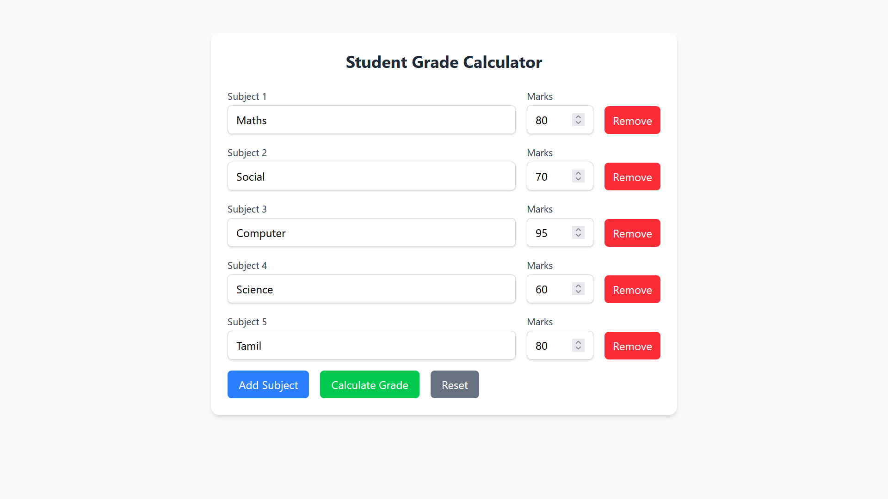
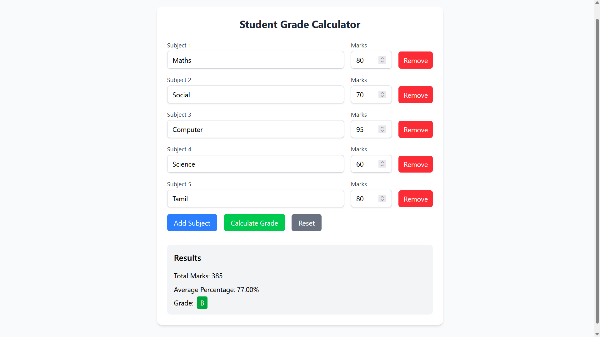

# 🎓 Student Grade Calculator

A full-stack web application that calculates total marks, average percentage, and grade based on student scores. Built with **Spring Boot (Java)** for the backend and **React + Vite + TailwindCSS** for the frontend.

---

## 🚀 Features

- 📝 Add Multiple Subjects – Dynamically add or remove any number of subjects with custom names
- 📊 Real-Time Grade Calculation – Calculates total marks, average percentage, and final grade instantly
- 🔢 Input Validation – Ensures marks are between 0 and 100
- 🧠 Smart Grading Logic – Assigns grades from A+ to F based on calculated average
- ♻️ Reset Functionality – Clear all fields and results with one click
- 💡 User-Friendly UI – Simple, intuitive interface built with Tailwind CSS
- ⚡ High Performance – Fast and responsive frontend powered by Vite
- 🔌 Seamless Backend Integration – Communicates with Spring Boot REST API
- 🔐 Secure & Robust – Isolated service layer for business logic and validation
- 🔄 Extensible Architecture – Easy to scale or enhance grading logic or rules  

---

## 🧰 Technologies Used

### 🖥️ Frontend
- **Vite** – Next generation frontend tooling
- **React** – JavaScript library for building user interfaces
- **Tailwind CSS** – Utility-first CSS framework
- **Axios** – Promise-based HTTP client

### 🖧 Backend
- **Spring Boot** – Java framework for microservices
- **Spring Web** – For building RESTful services

---

## 🧰 Technologies Used

### 🖥️ Frontend  
| Technology | Purpose |  
|------------|---------|  
|  | Blazing fast builds |  
|  | Interactive UI components |  
|  | Utility-first styling |  
|  | HTTP requests |  

### 🖧 Backend  
| Technology | Purpose |  
|------------|---------|  
|  | REST API service |  

---

## 🛠️ Installation

### 🔧 Prerequisites
- Node.js (v16+ recommended)
- Java JDK (17+ recommended)
- Maven

---

## 📁 Project Structure

```bash
Task1 (Number Guess)/
├── backend/                                        # Spring Boot backend
│ ├── src/
│ │ ├── main/
│ │ │ ├── java/com/task2/studentGradeCalculator/
│ │ │ │ ├── Controller/                             # REST controllers
│ │ │ │ ├── Model/                                  # Data models
│ │ │ │ ├── Service/                                # Business logic
│ │ │ │ └── studentGradeCalculatorApplication.java
│ │ │ └── resources/                                # Configuration files
│ │ └── test/                                       # Unit tests
│ └── pom.xml                                       # Maven configuration
│
├── frontend/                                       # React frontend
│ ├── src/
│ │ ├── components/                                 # React components
│ │ ├── services/                                   # API service layer
│ │ ├── App.jsx                                     # Main application component
│ │ └── main.jsx                                    # Application entry point
│ ├── public/                                       # Static assets
│ └── vite.config.js                                # Vite configuration
│
└── README.md                                       # Project documentation
```

## ⚛️ Frontend Setup

```bash
# Navigate to the frontend directory
cd frontend

# Install all dependencies
npm install

# Start the development server
npm run dev
```

The frontend will be available at `http://localhost:5173`


## ⚙️ Backend Setup

```bash
# Navigate to the backend directory
cd backend

# Build the project
mvn clean install

# Run the Spring Boot application
mvn spring-boot:run
```

The backend will be available at `http://localhost:8080`

---

## 📡 API Endpoints

| Method | Endpoint                         | Description             |
|--------|----------------------------------|-------------------------|
| POST   | `/api/grade/calculate`           | Accepts a list of marks and returns total, average percentage, and grade         |


---

## 🎮 How to Use

1. Add subjects by entering the subject name and marks (0-100).

2. Use the **Add Subject** button to add more subjects.

3. Use the **Remove** button to delete any unwanted subject entries.

4. Click the **Calculate Grade** button to submit the marks.

5. View the results showing total marks, average percentage, and the final grade.

6. Use the **Reset** button to clear all inputs and start fresh.

---

## 📸 Project Screenshots

### Home Screen


### Result

