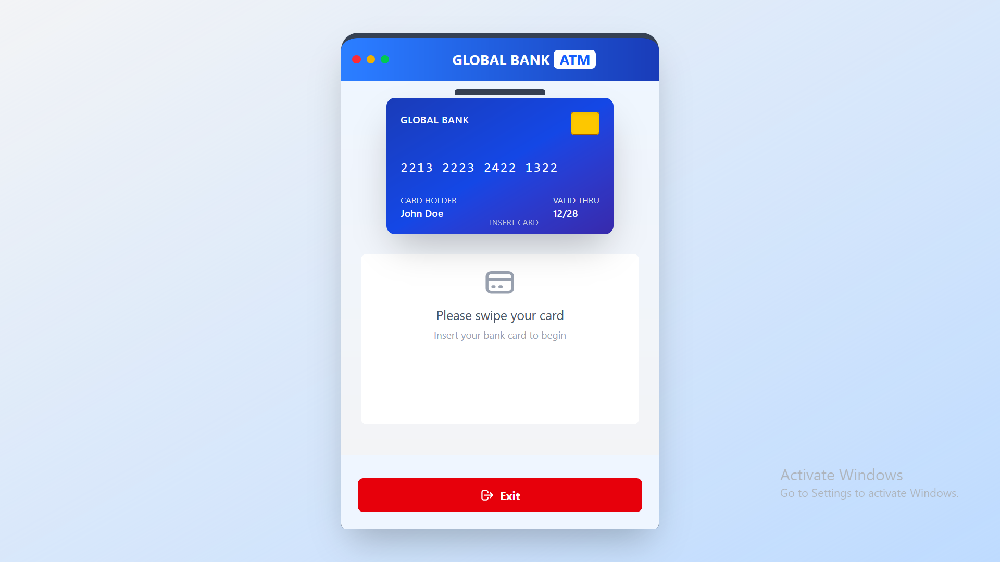
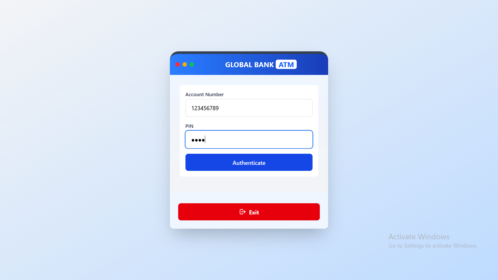
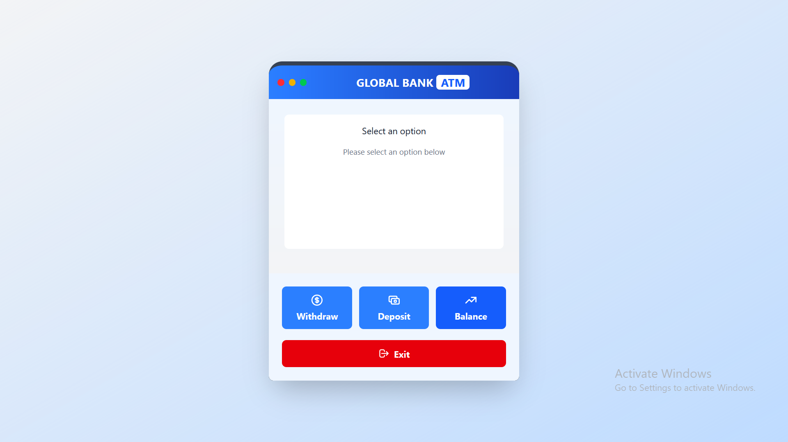
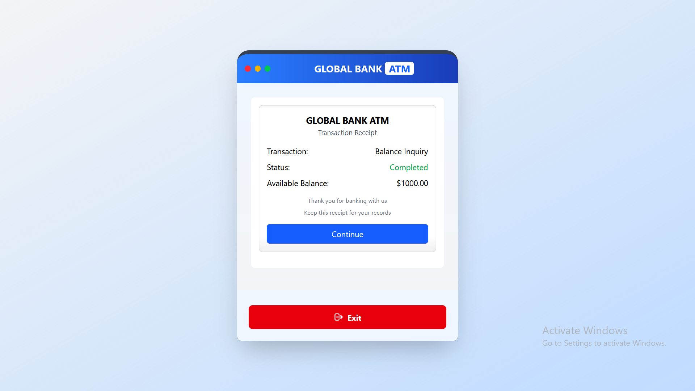
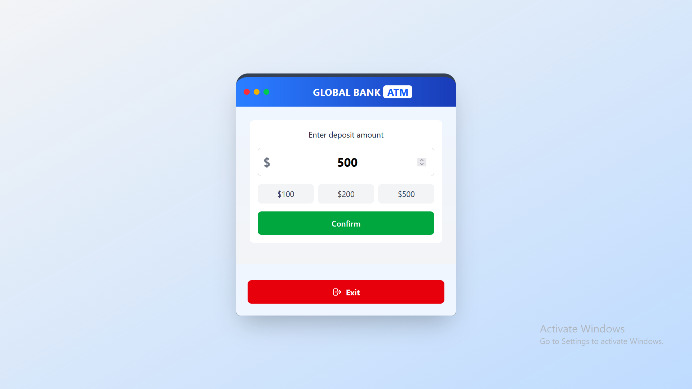
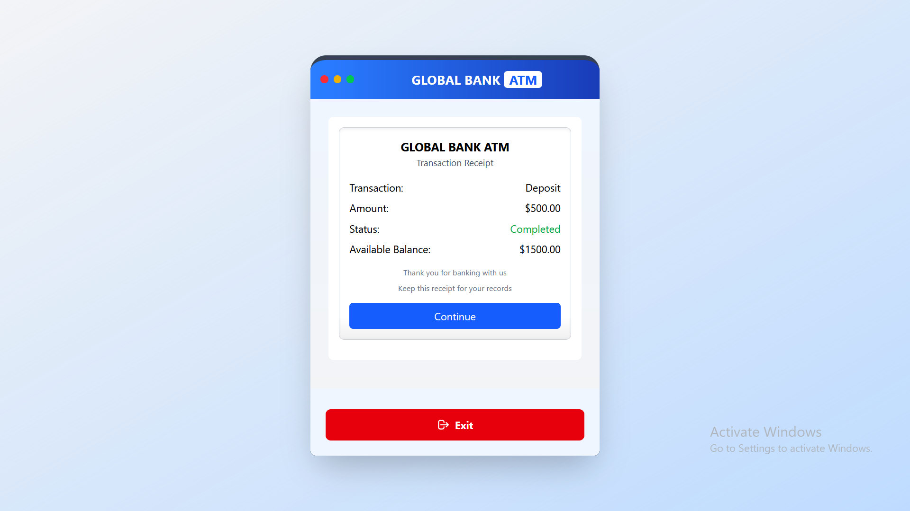

# 🏧 ATM Machine Simulator

A full-stack ATM simulation with **React (Vite) + Tailwind CSS** frontend and **Spring Boot** backend, featuring secure transactions and realistic UI.

---

## 🚀 Features
- 💳 **Card Insertion Animation** with interactive UI  
- 🔐 **PIN Authentication** (4-digit validation)  
- 💸 **Transaction Processing**:  
  - ➖ Cash withdrawals with balance checks  
  - ➕ Deposits with instant updates  
  - 📊 Real-time balance inquiries  
- 🧾 **Digital Receipts** for all transactions  
- ♿ **Keyboard Accessible** navigation  
- 📱 **Mobile-First Design** (fully responsive)   

---

## 🧰 Technologies Used

### Frontend  
| Technology | Purpose |  
|------------|---------|  
|  | Blazing fast builds |  
|  | Interactive UI components |  
|  | Utility-first styling |  
|  | HTTP requests |  

### Backend  
| Technology | Purpose |  
|------------|---------|  
|  | REST API service |  

---

## 🛠️ Installation

### 🔧 Prerequisites
- Node.js (v16+ recommended)
- Java JDK (17+ recommended)
- Maven

---

## 📁 Project Structure

```bash
Task1 (Number Guess)/
├── backend/                                        # Spring Boot backend
│ ├── src/
│ │ ├── main/
│ │ │ ├── java/com/task3/atmInterface/
│ │ │ │ ├── controller/                             # REST controllers
│ │ │ │ ├── model/                                  # Data models
│ │ │ │ ├── service/                                # Business logic
│ │ │ │ └── NumberGuessApplication.java
│ │ │ └── resources/                                # Configuration files
│ │ └── test/                                       # Unit tests
│ └── pom.xml                                       # Maven configuration
│
├── frontend/                                       # React frontend
│ ├── src/
│ │ ├── components/                                 # React components
│ │ ├── services/                                   # API service layer
│ │ ├── App.jsx                                     # Main application component
│ │ └── main.jsx                                    # Application entry point
│ ├── public/                                       # Static assets
│ └── vite.config.js                                # Vite configuration
│
└── README.md                                       # Project documentation
```

## ⚛️ Frontend Setup

```bash
# Navigate to the frontend directory
cd frontend

# Install all dependencies
npm install

# Start the development server
npm run dev
```

The frontend will be available at `http://localhost:5173`


## ⚙️ Backend Setup

```bash
# Navigate to the backend directory
cd backend

# Build the project
mvn clean install

# Run the Spring Boot application
mvn spring-boot:run
```

The backend will be available at `http://localhost:8080`

---

## 📡 API Endpoints

| Method | Endpoint           | Description           |
|--------|--------------------|-----------------------|
| POST   | /api/atm/withdraw  | Process withdrawal     |
| POST   | /api/atm/deposit   | Process deposit        |
| GET    | /api/atm/balance   | Check account balance  |

---

## How to Use

1. Open the frontend URL in your browser.
2. Insert the ATM card by clicking on the card UI.
3. Enter your account number and 4-digit PIN (default demo PIN: `1234`).
4. Select the desired transaction: Withdraw, Deposit, or Check Balance.
5. Follow prompts to complete your transaction.
6. Use the **Exit** button to end the session.

---

## 📸 Project Screenshots

### Auth Page (Login Screen)
")

---

### Card Swipe Screen


---

### Auth Page After Card Swipe


---

### Main Menu Screen


---

### Balance Inquiry Screen


---

### Deposit Transaction Screen



---

### Withdrawal Transaction Screen


---
