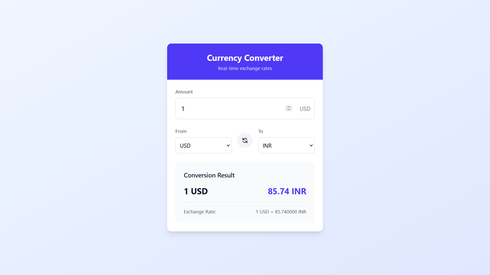
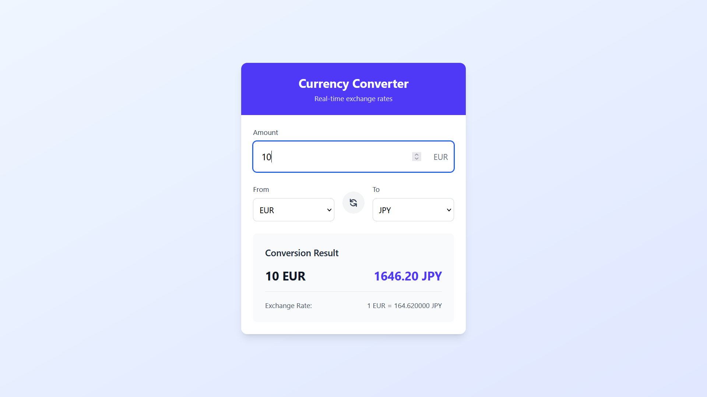

# 💱 Currency Converter

A full-stack currency converter app with **React (Vite) + Tailwind CSS** frontend and **Spring Boot** backend, providing real-time currency exchange conversion with a clean, responsive UI.

---

## 🚀 Features
- 💰 Convert amounts between multiple currencies (USD, EUR, GBP, JPY, etc.)  
- 🔄 Swap "From" and "To" currencies easily  
- 📡 Fetches latest exchange rates from backend API  
- 🕒 Shows last updated time for exchange rates  
- ⚠️ Error handling for network or API failures  
- 📱 Fully responsive design with Tailwind CSS  
- 🚀 Fast frontend with Vite + React hooks  

---

## 🧰 Technologies Used

### 🖥️ Frontend  
| Technology | Purpose |  
|------------|---------|  
|  | Fast frontend build tool |  
|  | UI components and state management |  
|  | Utility-first CSS framework |  

### 🖧 Backend  
| Technology | Purpose |  
|------------|---------|  
|  | RESTful API service |  
|  | Java project management |  

---

## 🛠️ Installation

### 🔧 Prerequisites
- Node.js (v16+ recommended)  
- Java JDK (17+ recommended)  
- Maven (for backend build)  

---

## 📁 Project Structure

```bash
currency-converter/
├── backend/                                        # Spring Boot backend
│   ├── src/
│   │   ├── main/
│   │   │   ├── java/com/yourorg/currencyconverter/
│   │   │   │   ├── controller/                     # REST controllers
│   │   │   │   ├── service/                        # Business logic
│   │   │   │   ├── model/                          # Data models
│   │   │   │   └── CurrencyConverterApplication.java
│   │   │   └── resources/                          # Config files (application.properties)
│   │   └── test/                                   # Unit tests
│   └── pom.xml                                     # Maven config
│
├── frontend/                                       # React frontend
│   ├── src/
│   │   ├── components/                             # React components (CurrencyConverter.jsx)
│   │   ├── App.jsx                                 # Main app component
│   │   └── main.jsx                                # Entry point
│   ├── public/                                     # Static assets
│   └── vite.config.js                              # Vite config
│
└── README.md                                       # Project documentation
```

## ⚛️ Frontend Setup

```bash
# Navigate to the frontend directory
cd frontend

# Install all dependencies
npm install

# Start the development server
npm run dev
```


The frontend will be available at http://localhost:5173


## ⚙️ Backend Setup

```bash
# Navigate to the backend directory
cd backend

# Build the project
mvn clean install

# Run the Spring Boot application
mvn spring-boot:run


The backend will be available at http://localhost:8080
```
---


## 📡 API Endpoints

| Method | Endpoint                            | Description                                      |
|--------|-------------------------------------|--------------------------------------------------|
| GET    | `/api/convert?from=USD&to=INR`      | Returns the exchange rate from USD to INR        |
| GET    | `/api/convert?from=EUR&to=JPY`      | Returns the exchange rate from EUR to JPY        |
| GET    | `/api/convert?from=<FROM>&to=<TO>`  | Replace `<FROM>` and `<TO>` with currency codes  |

✅ **Sample Response:**

```json
{
  "from": "USD",
  "to": "INR",
  "rate": 83.17,
  "lastUpdated": "2025-06-07T13:45:30Z"
}
```
---

## 📋 How to Use

1. **Enter the amount** you want to convert.
2. **Select** the **"From"** currency and the **"To"** currency.
3. Click **"Convert"** to fetch the latest exchange rate.
4. The **converted amount** and **exchange rate** will be displayed instantly.
5. Use the 🔁 **Swap** button to switch currencies quickly.


---

## 📸 Project Screenshots

### 🌐 Currency Converter UI

#### 🧮 Main Screen


#### 🔄 Swapping Currencies


#### 📊 Conversion Result

