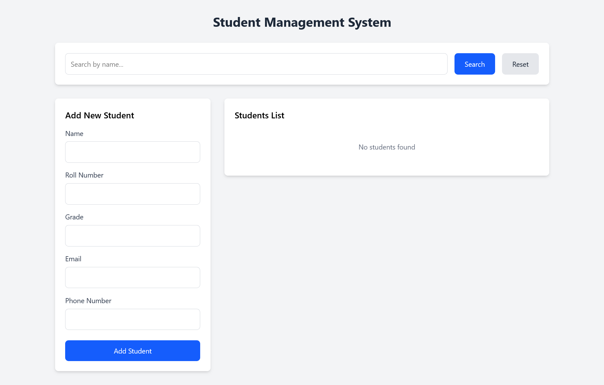
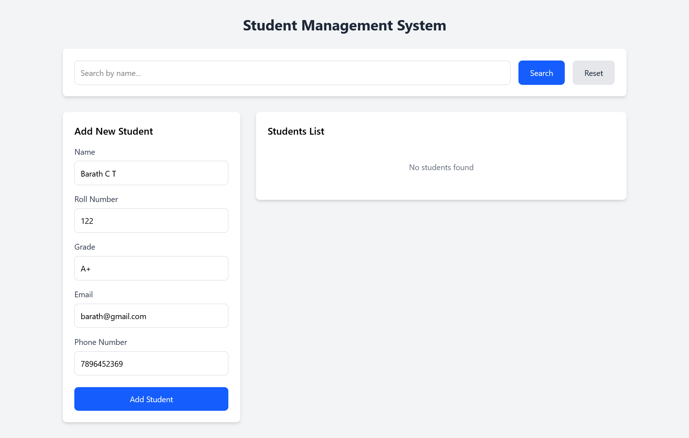
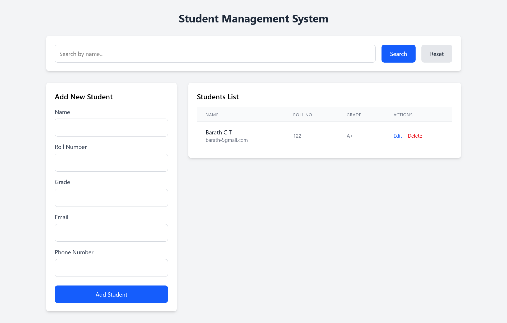
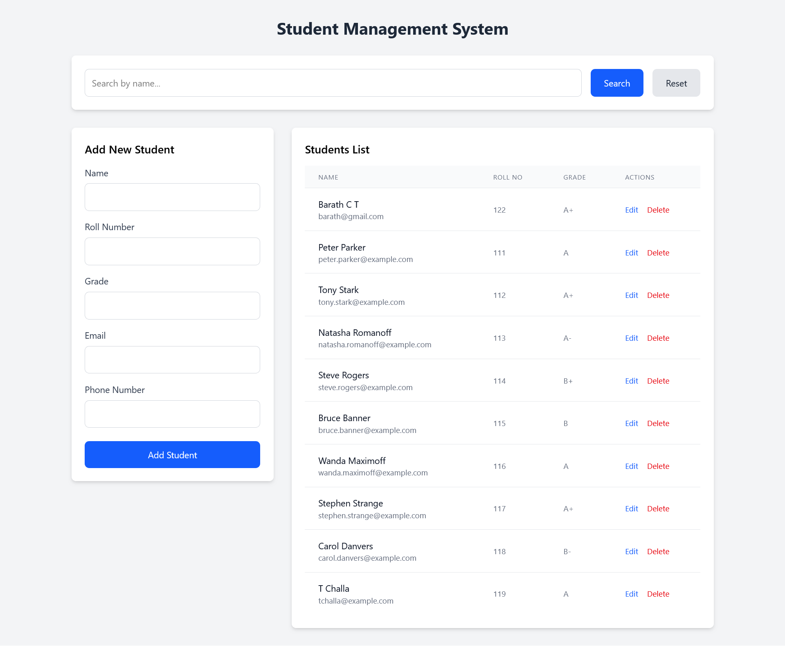
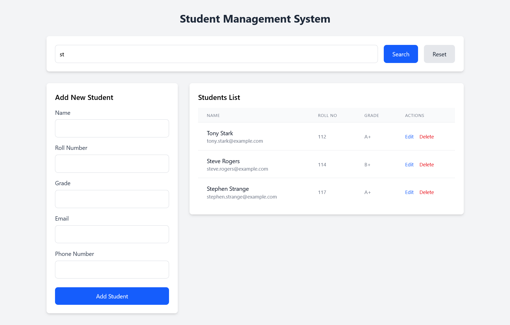
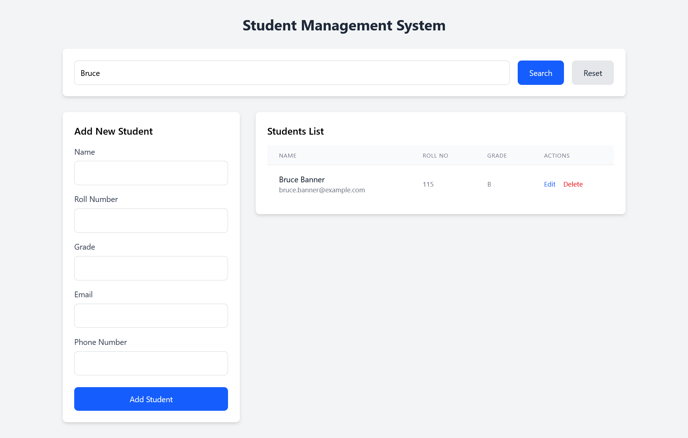

# 🎓 Student Management System

A full-stack Student Management System with React (Vite) + Tailwind CSS frontend and Spring Boot backend, providing seamless management of student data with a clean, responsive UI.

---

## 🚀 Features

- 🧑‍🎓 Add, update, delete student records

- 🔍 Search students by name, ID, or course

- 📋 View student details and list all students

- 🗂️ Pagination and sorting support

- ⚠️ Error handling for form validation and network issues

- 📱 Fully responsive design with Tailwind CSS

- 🚀 Fast frontend with Vite + React hooks

---

## 🧰 Technologies Used

### 🖥️ Frontend  
| Technology                                                                                           | Purpose                            |
| ---------------------------------------------------------------------------------------------------- | ---------------------------------- |
|                          | Fast frontend build tool           |
|                       | UI components and state management |
|  | Utility-first CSS framework        |


### 🖧 Backend  
| Technology                                                                                        | Purpose                 |
| ------------------------------------------------------------------------------------------------- | ----------------------- |
|  | RESTful API service     |
|             | Java project management |
|                    | Relational database     |


---

## 🛠️ Installation

### 🔧 Prerequisites
- Node.js (v16+ recommended)  
- Java JDK (17+ recommended)  
- Maven (for backend build)  

---

## 📁 Project Structure

```bash
student-management-system/
├── backend/                                        # Spring Boot backend
│   ├── src/
│   │   ├── main/
│   │   │   ├── java/com/yourorg/studentmanagement/
│   │   │   │   ├── controller/                     # REST controllers
│   │   │   │   ├── service/                        # Business logic
│   │   │   │   ├── model/                          # Data models/entities
│   │   │   │   ├── repository/                     # Spring Data repositories
│   │   │   │   └── StudentManagementApplication.java
│   │   │   └── resources/                          # Config files (application.properties)
│   │   └── test/                                   # Unit tests
│   └── pom.xml                                     # Maven config
│
├── frontend/                                       # React frontend
│   ├── src/
│   │   ├── components/                             # React components (StudentList.jsx, StudentForm.jsx, etc.)
│   │   ├── App.jsx                                 # Main app component
│   │   └── main.jsx                                # Entry point
│   ├── public/                                     # Static assets
│   └── vite.config.js                              # Vite config
│
└── README.md                                       # Project documentation

```

## ⚛️ Frontend Setup

```bash
# Navigate to the frontend directory
cd frontend

# Install all dependencies
npm install

# Start the development server
npm run dev
```


The frontend will be available at http://localhost:5173


## ⚙️ Backend Setup

```bash
# Navigate to the backend directory
cd backend

# Build the project
mvn clean install

# Run the Spring Boot application
mvn spring-boot:run


The backend will be available at http://localhost:8080
```
---


## 📡 API Endpoints

| Method | Endpoint             | Description            |
| ------ | -------------------- | ---------------------- |
| GET    | `/api/students`      | Get all students       |
| GET    | `/api/students/{id}` | Get student by ID      |
| POST   | `/api/students`      | Add a new student      |
| PUT    | `/api/students/{id}` | Update student details |
| DELETE | `/api/students/{id}` | Delete student by ID   |

✅ **Sample Response:**

```json
[
  {
    "id": 1,
    "name": "John Doe",
    "email": "john.doe@example.com",
    "course": "Computer Science",
    "enrollmentDate": "2024-08-20"
  },
  {
    "id": 2,
    "name": "Jane Smith",
    "email": "jane.smith@example.com",
    "course": "Mechanical Engineering",
    "enrollmentDate": "2023-09-15"
  }
]
```
---

## 📋 How to Use

1. View the list of all students.

2. Add new student records using the form.

3. Edit existing student details by selecting a student.

4. Delete a student if needed.

5. Search students by name or other details.

6. The UI is fully responsive and works well on all devices.


---

## 📸 Project Screenshots

### 🧑‍🎓 Student List Page

#### 🧮 Main Screen


---

#### 📋 Adding Student Details



---

#### 📋 After Inserting Multiple Students – 👨‍🎓👩‍🎓 Student Records Overview



---

#### Searching Student – 👁️ Quick Filter by Name or ID



---

#### 🔄 Updating Student Details – 🛠️ Edit and Save


---
